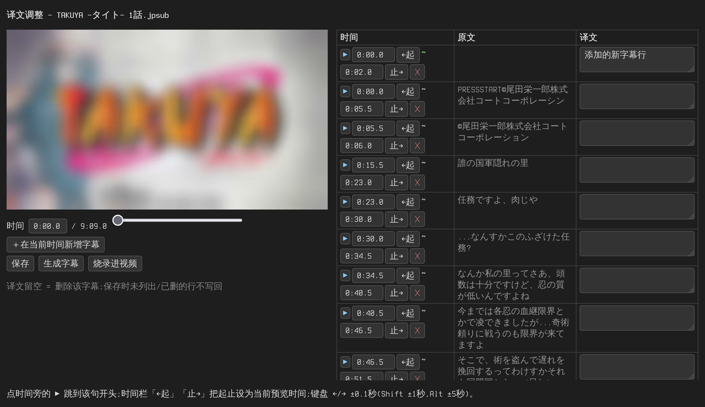
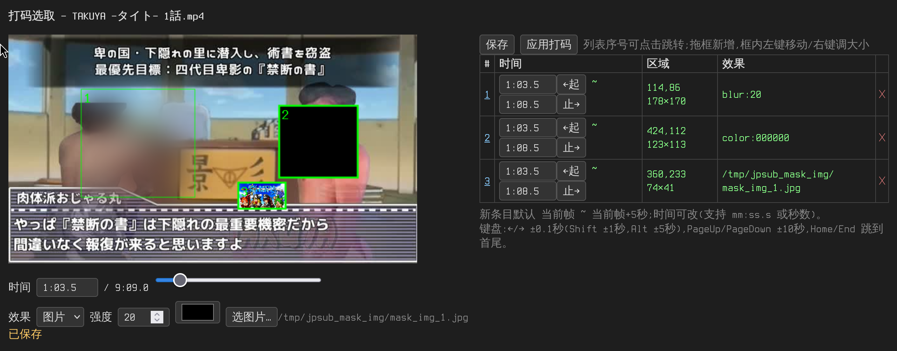

# jpsub — niconico 日语视频 → 中文字幕工具

从 niconico 下载日语视频（或使用本地视频），自动识别日语字幕、翻译成中文，生成外挂 ASS 字幕，也可以直接把字幕烧录进视频。面向普通用户的免安装 exe 程序。

**识别正确率**：静态对话框（不透明字幕框）近乎 100%；动态半透明对话框 95% 以上。个别漏识别/误识别的句子可按「6. 手动调整翻译」或「四、译文调整」修正。

## 〇、更新方式

更新时**只需把新版 `jpsub` 文件夹覆盖旧的即可**，其余一律不动：

- `.venv` —— Python 库，不用重装；
- `models` —— OCR 模型缓存，不用重新下载；
- `settings.py` —— 你的 AI 配置，保留；
- `bin` —— ffmpeg / yt-dlp，保留。

如果新版说明里提到**新增了依赖库**，按说明更新

## 一、准备工作

### 1. 开启全局代理（重要）

- 下载 niconico 视频、首次运行自动下载 OCR 识别模型，都需要访问国外网站。
- 请先开启你的代理软件（如 Clash、v2rayN 等）并开启**全局模式（Global）**。

### 2. 下载两个外部工具

请到官网手动下载（不要用命令行下载），全部放进程序目录下的 **`bin` 文件夹**：

| 工具   | 下载地址                                                                         | 说明                                                    |
| ------ | -------------------------------------------------------------------------------- | ------------------------------------------------------- |
| ffmpeg | https://www.gyan.dev/ffmpeg/builds/ （选 "ffmpeg-release-essentials.7z" 压缩包） | 解压后取 `bin` 文件夹里的 `ffmpeg.exe` 和 `ffprobe.exe` |
| yt-dlp | https://github.com/yt-dlp/yt-dlp/releases （下载 `yt-dlp.exe`）                  | 用于下载 niconico 视频                                  |

放好后程序目录应长这样：

```
.venv
jpsub
settings.py        ← 你的 AI 配置(可选,没有就用 bin 里的默认值)
ffmpeg.exe
ffprobe.exe
yt-dlp.exe
settings.py   ← 默认配置,不用动
```

也可以不用放进 `bin`，改为安装到系统并加入 PATH，二选一即可。

## 二、配置 AI 翻译

在程序目录新建 `settings.py`（打包版内置默认值，这个文件可覆盖它们），填入你的 AI 服务信息：

```python
API_BASE = "https://api.xxx.com/v1"   # OpenAI 兼容接口地址
API_KEY  = "sk-xxxx"                  # 你的密钥
MODEL    = "模型名"                    # 使用的模型
```

只有你想修改的项才需要写，其余保持默认。代理端口、字幕样式等参数也可在此文件里覆盖。

> 推荐 [千问 AI 平台](https://platform.qianwenai.com)：注册的免费额度够翻译几百个视频。

## 三、使用方法

在程序所在文件夹的地址栏输入 `cmd` 回车打开命令行，然后运行：

### 1. 最常用：一条命令下载视频 + 生成中文字幕

```
.venv\Scripts\jpsub.exe https://www.nicovideo.jp/watch/sm42567589
```

直接写 sm 号也可以：`.venv\Scripts\jpsub.exe sm43168834`。翻译完成后会自动打开**译文调整器**（见「四」），确认/修正译文后点 **生成字幕** 输出 `.ass`（不想调整可 Ctrl+C 跳过，之后用 `jpsub edit` 或 `jpsub render` 继续）。完成后同目录会得到视频 `sm42567589.mp4` 和字幕 `sm42567589.ass`，用 PotPlayer / MPC-HC 等播放器打开视频即可看到中文字幕。

### 2. 把字幕烧录进视频

```
.venv\Scripts\jpsub.exe sm43168834 --burn
```

烧录模式仍自动完成渲染，不打开译文调整器。已生成过字幕时会直接烧录，不再重新处理。

### 3. 本地视频生成字幕

```
.venv\Scripts\jpsub.exe run "output\lesson01.mp4" --comment "恐怖剧场"
```

`--comment` 简单描述视频内容，可提高翻译质量。也可要求AI比如不更改专有名词的翻译

### 4. 只想生成日文字幕和时间轴文件（不翻译）

```
.venv\Scripts\jpsub.exe run "output\lesson01.mp4" --notrans
```

运行后在工作目录(如output\sm114514.jpsub)生成 `translate-in.txt` `segments.json`（日文原文和时间轴），不会调用 AI 翻译。

之后执行 `render` 会生成**日文字幕**（没有任何译文时自动用日文原文填充）：

```
.venv\Scripts\jpsub.exe render output/sm114514.jpsub
```

### 5. 调整字幕样式

```
.venv\Scripts\jpsub.exe run sm43168834 --font "微软雅黑" --font-size 32 --max-chars 20
```

### 6. 手动调整翻译

推荐先看下一节「四、译文调整」——在浏览器里可视化改译文，不用手编文件。

手工方式:工作目录(如 output\sm114514.jpsub)下的 `translate-in.txt`(日文原文)和 `translate-out.txt`(中文译文),每行格式为 `起-止<TAB>文本`,时间轴为军方时间(无冒号),对应字幕显示的起止时间:

```
0058-0107.5	こより、コード:E3を発動する。日標は忍界全人類!!
0107.5-0112	世界に苦しみを......!
```

时间轴写法(军方时间,分、秒各占两位;带小数表示 0.1s 精度):

- `MMSS`:如 `1120` = 11:20,`0107.5` = 1分07.5秒;
- 有小时时前面再加 `HH`:如 `010120` = 1:01:20;
- 也兼容带冒号的写法:`11:20`、`1:01:20`,以及 ≤59 的纯秒数(如 `58`);
- 人工新增字幕时写 `MMSS` 即可,如 `0200-0205` 表示 2:00-2:05。

可以自由编辑,改完重新生成字幕即可:

- **改译文**:直接改 `translate-out.txt` 里对应行的中文;
- **改原文**:直接改 `translate-in.txt`(改后建议同步改 out 里的译文,否则会按新原文重新翻译);
- **删字幕**:把 `translate-out.txt` 里对应行**置空**(保留 `时间轴<TAB>`,后面不写文字)该句就不显示;
- **加字幕**:在两个文件里各加一行,时间轴写想要显示的起止时间(如 `0200-0205`),in 写日文(或留空直接在 out 写中文),out 写中文;
- **调时间轴**:改两行行首的 `起-止` 即可(out 里的时间轴以 in 为准,建议两处一起改)。

之后重新生成字幕文件:

```
.venv\Scripts\jpsub.exe run render output/sm114514.jpsub
```

> 如果 `translate-in.txt` 不小心删了/改乱了,运行 `extract` 可从 segments.json 原样重建(已有的译文不受影响)。

> 也可以直接用 AI 翻完后的 out 文件修正:AI 翻译错的人名/梗,改完保存再 render 即可,改动会自动进缓存。

### 7. 原字幕位置

运行时使用`--crop`参数指定原字幕位置，支持两种写法:

- 单数字: 取底部该占比高度, 如 `--crop 0.22`(从底部22%高度),大部分BB剧场的对话框(不加人名)都这么大.
- `上:下:左:右` 四边距: 从各边裁掉对应比例后保留中间区域, 如 `--crop 0.78:0.1:0.1:0.1`.

AI拓也使用 `--crop 1` 获取全部文字,并使用 `--batch-size 3` 降低ai翻译的压力

### 8. 跳过视频段

使用`--start` `--end`参数来制定仅截取在此之间的视频作为字幕来源.
例如11分45秒后为借物表, 不作为字幕源

```
.venv\Scripts\jpsub.exe run sm43168834 --end 11:45
```

### 9. 使用浏览器 cookies 下载（应对登录/地区限制）

下载时把浏览器的登录状态传给 yt-dlp，用 `--cookies-from-browser` 参数指定浏览器名：

```
.venv\Scripts\jpsub.exe sm43168834 --cookies-from-browser chrome
.venv\Scripts\jpsub.exe sm43168834 --cookies-from-browser edge
.venv\Scripts\jpsub.exe sm43168834 --cookies-from-browser firefox
```

也可以在 `settings.py` 里写 `COOKIES_FROM_BROWSER = "chrome"` 永久生效（命令行参数优先）。

> 注意：使用前请确保对应浏览器已**完全退出**（Firefox 可不用退出），否则 cookie 数据库可能被占用。

**yt-dlp 找不到浏览器配置（报 `could not find ... cookies database`）时**，完整语法为
`--cookies-from-browser 浏览器名[+KEYRING][:PROFILE][::CONTAINER]`：

- 支持的浏览器：`brave, chrome, chromium, edge, firefox, opera, safari, vivaldi, whale`
- `+KEYRING`：Linux 下 Chromium 系浏览器解密 cookie 用的密钥环，可选 `basictext, gnomekeyring, kwallet, kwallet5, kwallet6`
- `:PROFILE`：指定 profile 的**名称或路径**。找不到数据库通常是因为浏览器装在非默认位置，直接把 profile 文件夹的完整路径写在这里即可，例如：
  ```
  .venv\Scripts\jpsub.exe sm43168834 --cookies-from-browser "chrome:C:\Users\你的用户名\AppData\Local\Google\Chrome\User Data\Default"
  ```
- `::CONTAINER`：仅 Firefox，指定容器名（`none` 表示不使用容器），默认使用最近访问 profile 的所有容器。

## 四、译文调整（浏览器可视化）



AI 翻译难免有个别句子要改：直接在浏览器里逐条编辑，改完一键重新生成字幕。`run` / 下载全流程跑完翻译后也会自动打开这个页面。

```
.venv\Scripts\jpsub.exe edit output/sm114514.jpsub
```

（参数也可以直接给视频文件，如 `edit output/sm114514.mp4`）

会自动在浏览器打开译文调整器（本地页面，Ctrl+C 退出），左边是视频画面预览，右边逐条列出字幕（时间轴 / 日文原文 / 中文译文）：

- **改译文**：直接改右边译文框，随改随存（点「保存」写回 `translate-out.txt`）;
- **删字幕**：清空译文或点时间栏行末 **✕**，该句不再显示；
- **加字幕**：点 **＋在当前时间新增字幕**，填好起止时间和译文即可（自动按时间顺序插入列表）；
- **调时间轴**：直接改起止框（支持 `2:30.5` 或秒数），或用 **←起 / 止→** 按钮把起止设为当前预览时刻；
- **对画面**：拖动滑杆或键盘 `←/→` ±0.1秒（`Shift` ±1秒，`Alt` ±5秒）查看任意时刻画面，点时间栏的 **▶** 跳到该句开头；拖动时右侧列表会自动滚动到当前句；
- 改完点 **生成字幕**，等价于 `jpsub render`，直接输出新的 `.ass`；点 **烧录进视频** 则把新字幕直接烧进视频输出 `.burned.mp4`。

标成橙色的行是 AI 未返回译文的句子（`[[未译]]`），需要人工填写。保存后的改动与手工编辑 out 文件完全等价，会自动进翻译缓存。

## 五、打码（马赛克/遮挡敏感画面）



```
.venv\Scripts\jpsub.exe mask output/sm43168834.mp4
```

会自动在浏览器打开打码选取器（本地页面，Ctrl+C 退出），操作方式：

- **拖动时间轴**或点击画面下方的滑杆选择时刻；键盘更精确：`←/→` ±0.1秒（`Shift` ±1秒，`Alt` ±5秒），`PageUp/PageDown` ±10秒，`Home/End` 跳到首尾；
- **在画面上直接拖拽框选**要打码的区域，新条目默认从当前帧持续 5 秒（列表里可改，支持 `2:30.5` 或秒数两种写法）；
- **效果**三选一：`模糊`（可调强度）、`纯色`（取色器选色）、`图片`（点「选图片…」上传）；
- 点 **保存** 写入 `masks.txt`（在视频工作目录），点 **应用打码** 直接输出 `sm43168834.masked.mp4`。

也可以之后单独应用（比如手动改过 masks.txt）：

```
.venv\Scripts\jpsub.exe maskapply output/sm43168834.mp4
```

masks.txt 每行一条，格式为 `起-止<TAB>X,Y,宽,高<TAB>效果`，可直接手工编辑：

```
0:58.0-1:07.5	100,200,300,120	blur:25
1:20.0-1:30.0	0,0,640,360	color:000000
1:40.0-1:50.0	10,10,200,100	mask_img_1.png
```

## 六、批量模式（-s 脚本）

一次要处理很多视频时，逐条敲命令既慢又要盯着，可以用 `-s` 指定一个**脚本文件**批量执行：每行一条 jpsub 调用（规则同命令行，裸 URL / sm 号自动视为下载），程序会自动调度并行，全程不闲置。

**为什么用批量模式**：单个视频的处理分下载→OCR→翻译渲染三步，其中 OCR 只能单实例跑、下载和翻译却可以并行。手动逐条执行时，前一个视频翻译时机器在闲置；`-s` 模式把多个视频排成流水线——A 视频在 OCR 时，B 视频同时在下载、C 视频同时在翻译——一晚上挂一批视频，醒来全部完成。另外每个任务失败互不影响，结束后会汇总 `批量完成:N/M 成功`，失败的单独重跑即可（已有缓存不会重复消耗）。

```
.venv\Scripts\jpsub.exe -s jobs.txt
```

### 示例 1：最简单——一批 sm 号视频

```
sm43168834
sm42567589
sm44444444
```

每行一个视频，全部按默认流程执行：下载 → 识别 → 翻译 → 生成外挂字幕。和逐条敲 `.venv\Scripts\jpsub.exe sm号` 等价，只是写成文件一次跑完。

### 示例 2：每行带参数——不同视频不同处理

```
sm43168834 --burn
https://www.nicovideo.jp/watch/sm42567589 --comment "恐怖剧场"
run "D:\videos\lesson01.mp4" --crop 0.25
```

- 第 1 行：生成字幕后**直接烧录进视频**；
- 第 2 行：完整 URL 也可以，`--comment` 描述内容提高翻译质量；
- 第 3 行：`run` 处理**本地视频**，还能带 `--crop` 等任意参数。

即每行就是一条完整的 jpsub 命令（省略程序名），命令行里能写的参数这里都能写。

### 示例 3：完整示例——注释与可选参数

```
# 一批 BB 剧场视频（# 开头是注释行，会被跳过）
sm43168834 --burn
sm42567589 --guide-comment
```

- `#` 开头的行是注释，用来给自己分类备注；
- `--guide-comment`：追加翻译引导语，敏感内容被 API 拦截时加这个。

配合可选参数控制并发数（一般不用改，默认按 CPU 自动）：

```
.venv\Scripts\jpsub.exe -s jobs.txt --dl-workers 4 --tr-workers 2
```

- `--dl-workers N`：下载/抽帧阶段的并行进程数；
- `--tr-workers N`：翻译/渲染阶段的并发线程数。

## 七、常见问题

- **首次运行很慢 / 卡在下载模型**：首次使用会自动下载 OCR 模型，请确认代理已开启全局模式，耐心等待。
- **下载视频失败**：检查代理是否为全局模式、`bin` 文件夹里 `yt-dlp.exe` 是**最新版**且有 `ffmpeg.exe` 和 `ffprobe.exe`（合并音视频必需）。
- **翻译中断了**：直接重跑translate命令即可，已翻译的内容有缓存，不会重复消耗。

  ```
  .venv\Scripts\jpsub.exe run translate output/sm114514.jpsub
  ```

- **字幕没显示**：确认 `.ass` 字幕文件与视频同名并放在同一文件夹，使用支持外挂字幕的播放器。
- **字幕位置/字体想改**：样式可在 `settings.py` 的 ASS 字幕样式区修改，或用 `--font/--font-size` 等参数指定并重新生成。
  ```
  .venv\Scripts\jpsub.exe render output/sm114514.jpsub --font "微软雅黑" --font-size 32 --max-chars 20
  ```
