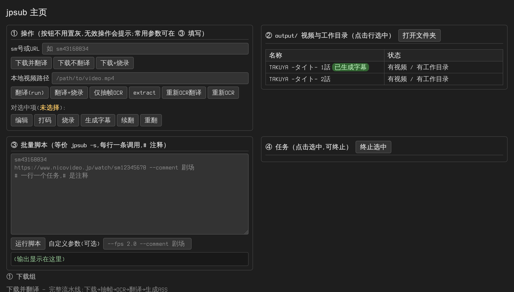

# jpsub — niconico 日语视频 → 中文字幕工具

从 niconico 下载日语视频（或使用本地视频），自动识别日语字幕、翻译成中文，生成外挂 ASS 字幕，也可以直接把字幕烧录进视频。面向普通用户的免安装 exe 程序。

**识别正确率**：静态对话框（不透明字幕框）近乎 100%；动态半透明对话框 95% 以上。个别漏识别/误识别的句子可按「四、译文调整」修正。

## 〇、更新方式

更新时**只需把新版 `jpsub` 文件夹覆盖旧的即可**：

- `.venv` —— Python 库，不用重装；
- `models` —— OCR 模型缓存，不用重新下载；
- `settings.py` —— 你的配置，迁移到新版的`settings example.py`并重命名为`settings.py`；
- `bin` —— ffmpeg / yt-dlp，保留。

如果新版说明里提到**新增了依赖库**，按说明更新

## 一、准备工作

### 使用打包版（推荐，最省事）

直接到本仓库的 **Releases** 页面下载打包好的程序，解压即用：

- **不需要**手动下载 ffmpeg / yt-dlp（已内置在 `bin` 里）；
- 已安装 Python 库和OCR 模型。

解压后需要更新版本，用仓库里**最新版的 `jpsub` 文件夹和 `settings example.py`** 覆盖/更新打包版里的对应文件（`settings example.py` 复制改名 `settings.py` 填入你的配置）。

### 使用源码运行

需要先完成下面两步。

### 1. 开启全局代理（重要）

- 下载 niconico 视频、首次运行自动下载 OCR 识别模型，都需要访问国外网站。
- 请先开启你的代理软件（如 Clash、v2rayN 等）并开启**全局模式（Global）**。

### 2. 下载两个外部工具

请到官网手动下载（不要用命令行下载），全部放进程序目录下的 **`bin` 文件夹**：

| 工具   | 下载地址                                                                         | 说明                                                    |
| ------ | -------------------------------------------------------------------------------- | ------------------------------------------------------- |
| ffmpeg | https://www.gyan.dev/ffmpeg/builds/ （选 "ffmpeg-release-essentials.7z" 压缩包） | 解压后取 `bin` 文件夹里的 `ffmpeg.exe` 和 `ffprobe.exe` |
| yt-dlp | https://github.com/yt-dlp/yt-dlp/releases （下载 `yt-dlp.exe`）                  | 用于下载 niconico 视频                                  |

放好后程序目录应长这样：

```
.venv
jpsub
settings.py        ← 你的 AI 配置(可选,没有就用 bin 里的默认值)
ffmpeg.exe
ffprobe.exe
yt-dlp.exe
settings.py   ← 默认配置,不用动
```

也可以不用放进 `bin`，改为安装到系统并加入 PATH，二选一即可。

## 二、配置 AI 翻译

在程序目录新建 `settings.py`（打包版内置默认值，这个文件可覆盖它们），填入你的 AI 服务信息：

```python
COOKIES_FROM_BROWSER = ""  # 登录/地区限制时填浏览器名,如 "chrome"(见 七.9)
# https://platform.qianwenai.com
# 注册的免费额度够几百个视频了
API_BASE = ""  # 例如 "https://maas.qianwenaiapi.com/compatible-mode/v1"
API_KEY = ""   # 例如 "sk-xxx"
MODEL = ""     # 例如 "qwen3.7-flash"
# 翻译速度很大程度上受各家模型影响,deepseek每秒token在200-300,且会听话的按提示词不多想,其他家的模型明显慢一些,有些还会自作聪明的试图理清人物关系和剧情导致更慢
# qwen容易对输入应激(特别是AI拓也), 使用mimo, 基本不会应激

PROXY = ""  # 例如 "http://127.0.0.1:1080",留空不走代理

# niconico 下载质量
# VIDEO:"lowest"=最低画质,"best"=最高画质,"360p"/"480p"/"720p"=指定分辨率
NICO_VIDEO_QUALITY = "360p"
# AUDIO:"lowest"=最低码率,"best"=最高码率, 一般只有64k/192k 两种
NICO_AUDIO_QUALITY = "lowest"

# OCR 模型(PaddleOCR PP-OCRv5 系列)
# 可选 _mobile_ 或 _medium_;实测 medium 在普通剧场字幕检测和识别上提升很小,但速度慢得多. 如果默认模型不理想可尝试
OCR_DET_MODEL = "PP-OCRv5_mobile_det"
OCR_REC_MODEL = "PP-OCRv5_mobile_rec"

# ---------- 字幕生成参数 ----------

# 抽帧:每秒抽几帧;CROP:截取视频底部高度的比例(字幕区域)
FPS = 2.0
CROP = "0.78:0.02:0.01:0.01"

# 关键帧筛选:掩膜差异阈值(越小越灵敏,漏段少但误判多);静止多少帧算停顿(越小越容易收尾);连续变化超过多少帧强制识别
DIFF_THRESHOLD = 2.0
SETTLE_FRAMES = 1
MAX_RUN = 10

# 段落合并:文本相似度阈值
SIMILARITY = 0.85

# 翻译:每次请求翻译的句数
BATCH_SIZE = 30

# ASS 字幕样式(位置交给播放器默认处理)
FONT = "Noto Sans CJK SC"  # 字体
FONT_SIZE = 20  # 字号
MAX_CHARS = 30  # 每行最大字数(超出折行)
OUTLINE_COLOR = (255, 165, 0)  # 描边颜色(RGB,当前为橙色)
OUTLINE_WIDTH = 1  # 描边宽度
SHADOW = 0  # 阴影宽度
```

程序目录下另有一份 `settings example.py` 是同样的带注释模板，可直接复制改名为 `settings.py` 使用。

只有你想修改的项才需要写，其余保持默认。

> 推荐 [千问 AI 平台](https://platform.qianwenai.com)：注册的免费额度够翻译几百个视频。

## 三、使用方法（主页）



双击/运行不带参数的命令，会自动打开浏览器主页（也可以用 `jpsub home`）：

```
.venv\Scripts\jpsub.exe
```

页面分四部分，**所有操作都在页面上点按钮完成，不用敲命令**：

- **① 操作**：输入 **sm 号或视频网址**点「下载并翻译」，或输入**本地视频路径**点「翻译(run)」；下方「对选中项」的按钮作用于 ② 中选中的条目。按钮永不置灰，无效操作会弹提示；
- **② output 列表**：自动列出 output/ 里的视频和 `.jpsub` 工作目录，每 3 秒自动刷新，显示「已生成字幕」「N 条未译」等徽章，**点击行选中**；
- **③ 批量脚本**：多行脚本框（每行一条任务，等价 `jpsub -s`，见「六」），点「运行脚本」批量执行，输出实时显示在下方框里；
- **④ 任务**：所有后台任务的实时进度（下载/OCR/翻译百分比、已完成/失败），每 1 秒刷新，每条标识为「视频名+操作」，**点击选中后可点「终止选中」结束它**。

### 常用操作

| 想做什么                                 | 怎么做                                                                 |
| ---------------------------------------- | ---------------------------------------------------------------------- |
| 下载 niconico 视频并生成中文字幕         | ① 输入 sm 号/网址 → 「下载并翻译」                                     |
| 下载但先不翻译（之后用「编辑」改译文）   | ① 输入 sm 号/网址 → 「下载不翻译」                                     |
| 下载并把字幕直接烧进视频                 | ① 输入 sm 号/网址 → 「下载+烧录」                                      |
| 本地视频生成中文字幕                     | ① 输入本地视频路径 → 「翻译(run)」                                     |
| 本地视频字幕烧进视频                     | ① 输入路径 → 「翻译+烧录」                                             |
| 只生成日文原文和时间轴（不调 AI）        | ① 输入路径 → 「仅抽帧OCR」                                             |
| 改译文 / 删字幕 / 加字幕                 | ② 选中条目 → 「编辑」（见「四」）                                      |
| 给画面打码                               | ② 选中条目 → 「打码」（见「五」）                                      |
| 用改好的译文重新生成字幕文件             | ② 选中条目 → 「生成字幕」                                              |
| 继续翻译没翻完的句子                     | ② 选中条目 → 「续翻」                                                  |
| 推倒重来：重新 OCR / 重新翻译            | 「重新OCR翻译」「重新OCR」按钮或 ② 选中条目 → 「重翻」（等价 --force） |
| 把已有字幕烧进视频（打过码则先打码再烧） | ② 选中条目 → 「烧录」                                                  |
| 一次处理很多视频                         | ③ 脚本框每行写一个 sm 号 → 「运行脚本」（见「六」）                    |

翻译完成（除烧录模式外）会自动打开**译文调整器**让你确认/修正译文，点 **生成字幕** 输出 `.ass`。

页面底部的灰字有每个按钮的详细说明。个别参数（如 `--fps 2.0`、`--comment 剧场`）可填在 ③ 的「自定义参数」框，会追加到之后发起的所有命令后。

## 四、译文调整（浏览器可视化）


AI 翻译难免有个别句子要改：直接在浏览器里逐条编辑，改完一键重新生成字幕。主页跑完翻译后也会自动打开这个页面（也可 ② 选中条目点「编辑」）。

会自动在浏览器打开译文调整器（本地页面，关闭即可），左边是视频画面预览，右边逐条列出字幕（时间轴 / 日文原文 / 中文译文）：

- **改译文**：直接改右边译文框，随改随存（点「保存」写回 `segments.json`）;
- **删字幕**：清空译文或点时间栏行末 **✕**，该句不再显示；
- **加字幕**：点 **＋在当前时间新增字幕**，填好起止时间和译文即可（自动按时间顺序插入列表）；
- **调时间轴**：直接改起止框（支持 `2:30.5` 或秒数），或用 **←起 / 止→** 按钮把起止设为当前预览时刻；
- **对画面**：拖动滑杆或键盘 `←/→` ±0.1秒（`Shift` ±1秒，`Alt` ±5秒）查看任意时刻画面，点时间栏的 **▶** 跳到该句开头；拖动时右侧列表会自动滚动到当前句；
- **还原改动**：点 **还原改动** 从 OCR 原始备份 `segments.orig.json` 一键撤销所有编辑（译文/增删恢复到刚识别完的状态）；
- 改完点 **生成字幕**，直接输出新的 `.ass`；点 **烧录进视频** 则把新字幕直接烧进视频输出 `.burned.mp4`。

标成橙色的行是 AI 未返回译文的句子（`[[未译]]`），需要人工填写。所有编辑直接写回工作目录的 `segments.json`（原文与译文统一存这里），有效译文会自动进翻译缓存。

## 五、打码（马赛克/遮挡敏感画面）


主页 ② 选中条目点「打码」（或命令行 `jpsub mask output/sm43168834.mp4`），会自动在浏览器打开打码选取器（本地页面，关闭即可），操作方式：

- **拖动时间轴**或点击画面下方的滑杆选择时刻；键盘更精确：`←/→` ±0.1秒（`Shift` ±1秒，`Alt` ±5秒），`PageUp/PageDown` ±10秒，`Home/End` 跳到首尾；
- **在画面上直接拖拽框选**要打码的区域，新条目默认从当前帧持续 5 秒（列表里可改，支持 `2:30.5` 或秒数两种写法）；
- **效果**三选一：`模糊`（可调强度）、`纯色`（取色器选色）、`图片`（点「选图片…」上传）；
- 点 **保存** 写入 `masks.json`（在视频工作目录），点 **应用打码** 直接输出 `sm43168834.masked.mp4`。

也可以命令行单独应用（比如手动改过 masks.json）：`jpsub maskapply output/sm43168834.mp4`。加 `--burn` 可在打码后接着把同名 `.ass` 字幕烧进结果，一步得到打码+字幕的成品——主页的「烧录」按钮检测到工作目录里有 masks.json 时会自动走这条链路。

masks.json 为 JSON 数组，每条含起止秒、像素坐标与效果，可直接手工编辑：

```json
[
  {
    "start": 58.0,
    "end": 67.5,
    "x": 100,
    "y": 200,
    "w": 300,
    "h": 120,
    "effect": "blur:25"
  },
  {
    "start": 80.0,
    "end": 90.0,
    "x": 0,
    "y": 0,
    "w": 640,
    "h": 360,
    "effect": "color:000000"
  },
  {
    "start": 100.0,
    "end": 110.0,
    "x": 10,
    "y": 10,
    "w": 200,
    "h": 100,
    "effect": "/tmp/jpsub_mask_img/mask_img_1.png"
  }
]
```

> 旧版的 `masks.txt` 文本格式仍能自动识别读取，无需手动转换。

## 六、批量模式（-s 脚本）

一次要处理很多视频时，可以在主页 ③ 的脚本框里每行写一条任务点「运行脚本」；命令行方式则是用 `-s` 指定一个**脚本文件**批量执行：每行一条 jpsub 调用（规则同命令行，裸 URL / sm 号自动视为下载），程序会自动调度并行，全程不闲置。

**为什么用批量模式**：单个视频的处理分下载→OCR→翻译渲染三步，其中 OCR 只能单实例跑、下载和翻译却可以并行。手动逐条执行时，前一个视频翻译时机器在闲置；批量模式把多个视频排成流水线——A 视频在 OCR 时，B 视频同时在下载、C 视频同时在翻译——一晚上挂一批视频，醒来全部完成。另外每个任务失败互不影响，结束后会汇总 `批量完成:N/M 成功`，失败的单独重跑即可（已有缓存不会重复消耗）。

### 示例 1：最简单——一批 sm 号视频

```
sm43168834
sm42567589
sm44444444
```

每行一个视频，全部按默认流程执行：下载 → 识别 → 翻译 → 生成外挂字幕。

### 示例 2：每行带参数——不同视频不同处理

```
sm43168834 --burn
https://www.nicovideo.jp/watch/sm42567589 --comment "恐怖剧场"
run "D:\videos\lesson01.mp4" --crop 0.25
```

- 第 1 行：生成字幕后**直接烧录进视频**；
- 第 2 行：完整 URL 也可以，`--comment` 描述内容提高翻译质量；
- 第 3 行：`run` 处理**本地视频**，还能带 `--crop` 等任意参数。

即每行就是一条完整的 jpsub 命令（省略程序名），命令行里能写的参数这里都能写。

### 示例 3：完整示例——注释与可选参数

```
# 一批 BB 剧场视频（# 开头是注释行，会被跳过）
sm43168834 --burn
sm42567589 --fps 2.0
```

- `#` 开头的行是注释，用来给自己分类备注；
- 每行可以带 `run` 支持的任意参数。

配合可选参数控制并发数（一般不用改，默认按 CPU 自动）：

```
.venv\Scripts\jpsub.exe -s jobs.txt --dl-workers 4 --tr-workers 2
```

- `--dl-workers N`：下载/抽帧阶段的并行进程数；
- `--tr-workers N`：翻译/渲染阶段的并发线程数。

## 七、命令行参考

主页能完成日常全部操作；以下命令行方式供进阶使用，所有参数也都能写在批量脚本行里。在程序所在文件夹的地址栏输入 `cmd` 回车打开命令行后运行。

### 1. 最常用：一条命令下载视频 + 生成中文字幕

```
.venv\Scripts\jpsub.exe https://www.nicovideo.jp/watch/sm42567589
```

直接写 sm 号也可以：`.venv\Scripts\jpsub.exe sm43168834`。翻译完成后会自动打开**译文调整器**（见「四」），确认/修正译文后点 **生成字幕** 输出 `.ass`（不想调整可 Ctrl+C 跳过，之后用 `jpsub edit` 或 `jpsub render` 继续）。完成后同目录会得到视频 `sm42567589.mp4` 和字幕 `sm42567589.ass`，用 PotPlayer / MPC-HC 等播放器打开视频即可看到中文字幕。

### 2. 把字幕烧录进视频

```
.venv\Scripts\jpsub.exe sm43168834 --burn
```

烧录模式仍自动完成渲染，不打开译文调整器。已生成过字幕时会直接烧录，不再重新处理。

### 3. 本地视频生成字幕

```
.venv\Scripts\jpsub.exe run "output\lesson01.mp4" --comment "恐怖剧场"
```

`--comment` 简单描述视频内容，可提高翻译质量。也可要求AI比如不更改专有名词的翻译

### 4. 只想生成日文字幕和时间轴文件（不翻译）

```
.venv\Scripts\jpsub.exe run "output\lesson01.mp4" --notrans
```

运行后在工作目录(如output\sm114514.jpsub)生成 `segments.json`（日文原文和时间轴，另有原始备份 `segments.orig.json`），不会调用 AI 翻译。

之后执行 `render` 会生成**日文字幕**（没有任何译文时自动用日文原文填充）：

```
.venv\Scripts\jpsub.exe render output/sm114514.jpsub
```

### 5. 调整字幕样式

```
.venv\Scripts\jpsub.exe run sm43168834 --font "微软雅黑" --font-size 32 --max-chars 20
```

### 6. 手动调整翻译

推荐先看「四、译文调整」——在浏览器里可视化改译文（支持一键还原 OCR 原始结果），不用手编文件。

字幕数据统一存在工作目录(如 output\sm114514.jpsub)下的 `segments.json`：每段含 `start`/`end`(秒)、`text`(日文原文)、`tr`(中文译文，缺省/`[[未译]]` 表示未翻)。可直接手工编辑：

```json
{
  "segments": [
    {
      "start": 58.0,
      "end": 107.5,
      "text": "こより、コード:E3を発動する。",
      "tr": "小依理、发动代码:E3。目标是忍界全人类!!"
    },
    { "start": 107.5, "end": 112.0, "text": "世界に苦しみを......!" }
  ],
  "comment": null
}
```

编辑要点：

- **改译文**：直接改对应段的 `tr`；
- **删字幕**：删掉整个该段对象（或把 `tr` 改成无效内容）该句就不显示；
- **加字幕**：加一个对象，`start`/`end` 写秒数，没有原文时 `text` 直接写中文、`tr` 也写同样内容；
- **调时间轴**：改该段的 `start`/`end`（单位秒）。

之后重新生成字幕文件：

```
.venv\Scripts\jpsub.exe render output/sm114514.jpsub
```

> 如果 `segments.json` 不小心改乱了：点调整器里的 **还原改动** 按钮（或删除它后重跑 `extract`）可从原始备份 `segments.orig.json` 恢复到 OCR 刚识别完的状态。

> **防误操作备份**：OCR 覆盖 segments.json、翻译/调整器写回译文之前,都会自动把旧文件备份到工作目录的 `backup/时间戳/` 文件夹,改坏了可以从那里找回。

> **默认不重复劳动**：已有 segments.json 时跳过 OCR 直接沿用,已译的句子续翻时自动跳过,都读缓存。想推倒重来加 `--force`：`run --force` 重新抽帧 OCR+翻译、`extract --force` 只重跑 OCR、`translate --force` 忽略已有译文和缓存全部重翻（主页对应「重新OCR翻译」「重新OCR」「重翻」按钮,force 操作同样先备份）。

> 也可以直接修正 AI 译文后重 render,改动会自动进缓存。

> 旧工作目录里的 `translate-in.txt` / `translate-out.txt` 已不再使用（新流程不生成）；已有 out 译文会在下次运行时自动导入 segments,旧文件保留不删。

### 7. 原字幕位置

运行时使用`--crop`参数指定原字幕位置，支持两种写法:

- 单数字: 取底部该占比高度, 如 `--crop 0.22`(从底部22%高度),大部分BB剧场的对话框(不加人名)都这么大.
- `上:下:左:右` 四边距: 从各边裁掉对应比例后保留中间区域, 如 `--crop 0.78:0.1:0.1:0.1`.

AI拓也使用 `--crop 1` 获取全部文字,并使用 `--batch-size 3` 降低ai翻译的压力

### 8. 跳过视频段

使用`--start` `--end`参数来制定仅截取在此之间的视频作为字幕来源.
例如11分45秒后为借物表, 不作为字幕源

```
.venv\Scripts\jpsub.exe run sm43168834 --end 11:45
```

### 9. 使用浏览器 cookies 下载（应对登录/地区限制）

下载时把浏览器的登录状态传给 yt-dlp，用 `--cookies-from-browser` 参数指定浏览器名：

```
.venv\Scripts\jpsub.exe sm43168834 --cookies-from-browser chrome
.venv\Scripts\jpsub.exe sm43168834 --cookies-from-browser edge
.venv\Scripts\jpsub.exe sm43168834 --cookies-from-browser firefox
```

也可以在 `settings.py` 里写 `COOKIES_FROM_BROWSER = "chrome"` 永久生效（命令行参数优先）。

> 注意：使用前请确保对应浏览器已**完全退出**（Firefox 可不用退出），否则 cookie 数据库可能被占用。

**yt-dlp 找不到浏览器配置（报 `could not find ... cookies database`）时**，完整语法为
`--cookies-from-browser 浏览器名[+KEYRING][:PROFILE][::CONTAINER]`：

- 支持的浏览器：`brave, chrome, chromium, edge, firefox, opera, safari, vivaldi, whale`
- `+KEYRING`：Linux 下 Chromium 系浏览器解密 cookie 用的密钥环，可选 `basictext, gnomekeyring, kwallet, kwallet5, kwallet6`
- `:PROFILE`：指定 profile 的**名称或路径**。找不到数据库通常是因为浏览器装在非默认位置，直接把 profile 文件夹的完整路径写在这里即可，例如：
  ```
  .venv\Scripts\jpsub.exe sm43168834 --cookies-from-browser "chrome:C:\Users\你的用户名\AppData\Local\Google\Chrome\User Data\Default"
  ```
- `::CONTAINER`：仅 Firefox，指定容器名（`none` 表示不使用容器），默认使用最近访问 profile 的所有容器。

## 八、常见问题

- **首次运行很慢 / 卡在下载模型**：首次使用会自动下载 OCR 模型，请确认代理已开启全局模式，耐心等待。
- **下载视频失败**：检查代理是否为全局模式、`bin` 文件夹里 `yt-dlp.exe` 是**最新版**且有 `ffmpeg.exe` 和 `ffprobe.exe`（合并音视频必需）。
- **翻译中断了**：主页选中条目点「续翻」即可（命令行 `jpsub translate output/sm114514.jpsub`），已翻译的内容有缓存，不会重复消耗。
- **字幕没显示**：确认 `.ass` 字幕文件与视频同名并放在同一文件夹，使用支持外挂字幕的播放器。
- **字幕位置/字体想改**：样式可在 `settings.py` 的 ASS 字幕样式区修改，或用 `--font/--font-size` 等参数指定并重新生成（见「七、命令行参考 5」）。
