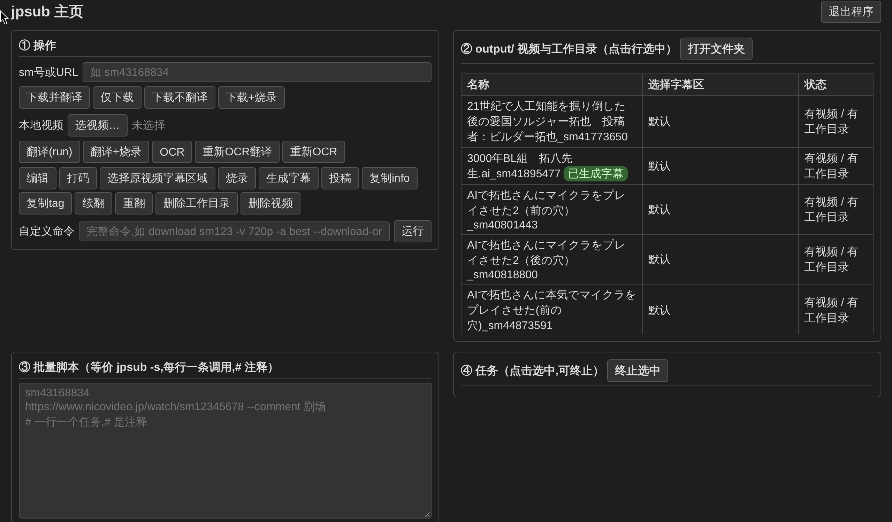
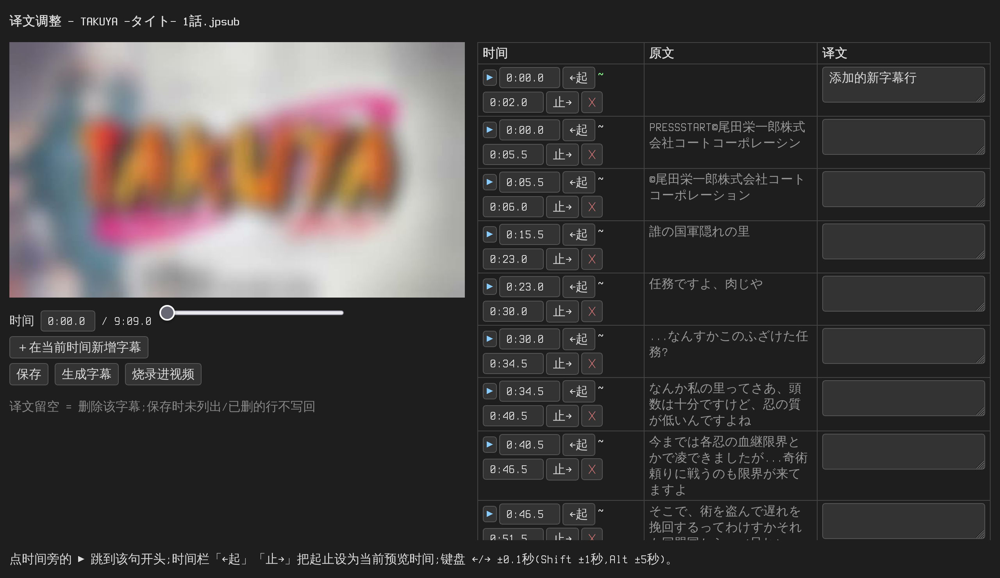
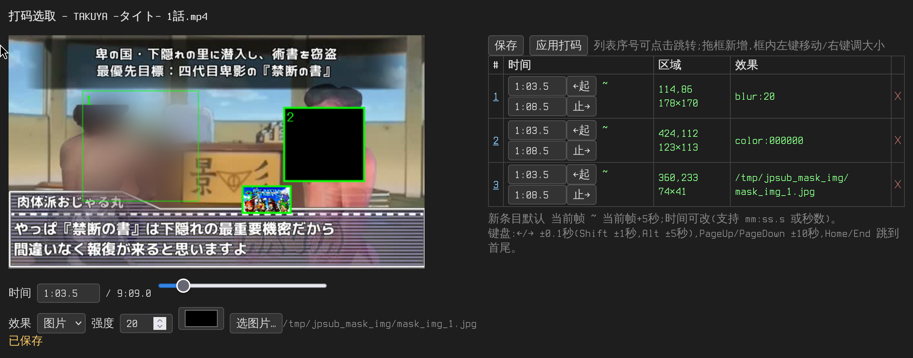

# jpsub — niconico 日语视频 → 中文字幕工具

从 niconico 下载日语视频（或使用本地视频），自动识别日语字幕、翻译成中文，生成外挂 ASS 字幕，也可以直接把字幕烧录进视频。面向普通用户的免安装 exe 程序。

- 全程浏览器点按钮，不用敲命令；
- 批量流水线：一晚上挂一批视频，醒来全部完成；
- 内置译文调整器和打码系统，改译文、打马赛克都在网页上完成。

## 快速开始

1. 到本仓库 **Releases** 页面下载打包好的程序，解压即用（已内置 ffmpeg / yt-dlp 和 Python 库，OCR 走在线 API，无本地模型）；
2. 把 `settings example.py` 复制改名为 `settings.py`，填入你的 AI 翻译与 OCR 配置（详见 [doc/settings.md](doc/settings.md)）；
3. 开启代理软件的**全局模式**，双击运行程序自动打开浏览器主页（详见 [doc/home.md](doc/home.md)）。

## 使用方法（主页）

双击/运行不带参数的命令，会自动打开浏览器主页（也可以用 `jpsub home`）。页面分四部分，**所有操作都在页面上点按钮完成，不用敲命令**：

- **① 操作**：输入 **sm 号或视频网址**点「下载并翻译」，或输入**本地视频路径**点「翻译(run)」；
- **② output 列表**：自动列出 output/ 里的视频和 `.jpsub` 工作目录，点击行选中，对选中项可「编辑 / 打码 / 烧录 / 续翻 / 重翻」等；
- **③ 批量脚本**：每行一条任务，点「运行脚本」批量执行（详见 [doc/batch.md](doc/batch.md)）；
- **④ 任务**：所有后台任务的实时进度，点击选中后可「终止选中」。

翻译完成（除烧录模式外）会自动打开**译文调整器**让你确认/修正译文，点 **生成字幕** 输出 `.ass`。

还内置**打码系统**：网页上框选区域即可给画面打马赛克/遮挡/静音（详见 [doc/mask.md](doc/mask.md)）。

更多细节与常用操作表见 [doc/home.md](doc/home.md)。

## 文档目录

| 文档                               | 内容                                         |
| ---------------------------------- | -------------------------------------------- |
| [doc/update.md](doc/update.md)     | 更新方式                                     |
| [doc/install.md](doc/install.md)   | 源码运行准备（全局代理、下载 ffmpeg/yt-dlp） |
| [doc/settings.md](doc/settings.md) | `settings.py` 配置详解（AI 翻译与 OCR）      |
| [doc/home.md](doc/home.md)         | 主页各分区与按钮详细说明                     |
| [doc/edit.md](doc/edit.md)         | 译文调整器（浏览器可视化改译文）             |
| [doc/mask.md](doc/mask.md)         | 打码（马赛克/遮挡/静音）                     |
| [doc/batch.md](doc/batch.md)       | 批量模式（-s 脚本）                          |
| [doc/perf.md](doc/perf.md)         | 性能调优（翻译 token 与耗时）                |
| [doc/cli.md](doc/cli.md)           | 命令行参考（进阶）                           |
| [doc/faq.md](doc/faq.md)           | 常见问题                                     |
